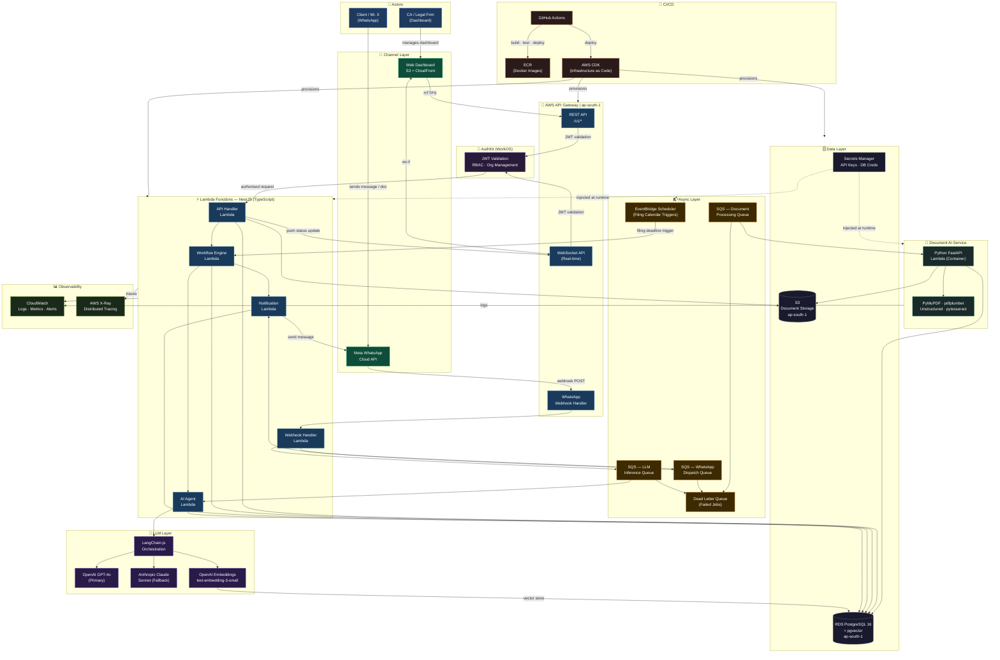
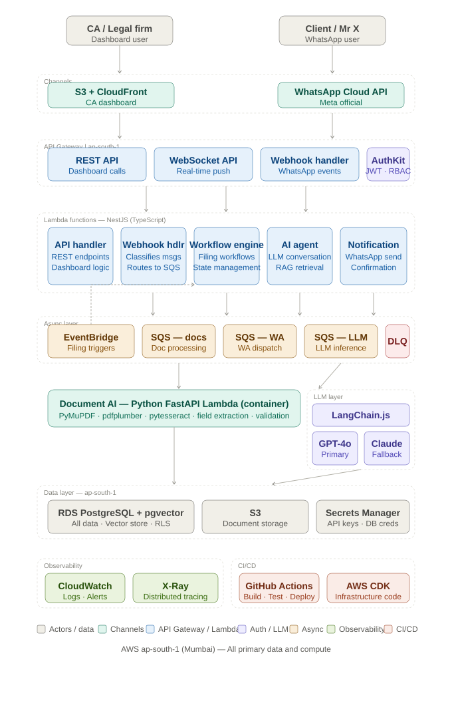

# BotStackHQ — Architecture Decision Document (ADD)
### ComplianceStack — Phase 1 MVP
**CipherCru Innovations | 2026**
**Status: ✅ LOCKED**
**Scope: ComplianceStack MVP — CA / Legal Compliance Workflow Automation**

---

## Purpose

This document is the single source of truth for all architectural decisions made for BotStackHQ Phase 1 — ComplianceStack MVP. Every decision is recorded with its context, rationale, alternatives considered, and consequences. No agent or engineer builds outside this document's boundaries without a formal decision update.

---

## Table of Contents

1. System Overview
2. Phase 1 Architecture Design Diagram
3. Architecture Style
4. Backend Runtime & Framework
5. API Layer
6. Database
7. Job Scheduling & Queuing
8. Document AI
9. LLM & Agent Orchestration
10. WhatsApp Integration
11. Frontend
12. Authentication & Authorization
13. Multi-Tenancy Model
14. File & Document Storage
15. CI/CD Pipeline
16. Monitoring & Observability
17. Security Baseline
18. Data Residency & Compliance
19. Decision Log

---

## 01 System Overview

BotStackHQ ComplianceStack is a bilateral AI-powered compliance workflow automation platform for Chartered Accountants and Legal Service Providers.

**Core function:** Automate the full lifecycle of compliance filing — input collection from clients, document ingestion, CA notification, filing confirmation delivery — across monthly, quarterly, and yearly cycles.

**Two actors:**
- **CA (Service Provider)** — manages 10–100 clients, files reports, needs inputs before filing and confirmation delivery after
- **Client (Mr. X)** — provides inputs on request, receives filing confirmations, interacts primarily via WhatsApp

**Primary communication channel:** WhatsApp (both directions)

**System responsibilities:**
- Maintain filing calendar per CA workspace
- Trigger input collection workflows at correct intervals
- Collect and validate client inputs and documents via WhatsApp
- Notify CA when inputs are complete
- Send filing confirmation to client after CA acts
- Maintain full audit trail per client per filing

---

## 02 Phase 1 Architecture Design Diagram

The diagram below represents the complete Phase 1 system architecture for BotStackHQ ComplianceStack. It covers all runtime components, data flows, and service boundaries as locked in this document.



### Diagram Key — Component Responsibilities

| Component | Layer | Responsibility |
|-----------|-------|---------------|
| Meta WhatsApp Cloud API | Channel | Inbound client messages, document uploads, outbound notifications |
| S3 + CloudFront | Channel | CA dashboard static hosting, global CDN |
| API Gateway REST | Entry | All dashboard and external API traffic, JWT authorisation |
| API Gateway WebSocket | Entry | Real-time filing status push to CA dashboard |
| WhatsApp Webhook Handler | Entry | Receives all inbound WhatsApp events, routes to SQS |
| AuthKit (WorkOS) | Auth | JWT validation, RBAC, workspace isolation, org management |
| API Handler Lambda | Core | Business logic for all REST endpoints |
| Webhook Handler Lambda | Core | Classifies inbound WhatsApp messages, enqueues for processing |
| Workflow Engine Lambda | Core | Executes filing workflows, triggers reminders, manages state |
| Notification Lambda | Core | Dispatches WhatsApp messages via Meta API, confirmation delivery |
| AI Agent Lambda | Core | LLM-driven conversation handling, RAG retrieval, response generation |
| Python FastAPI Lambda | Document AI | PDF extraction, OCR, field validation, document completeness check |
| EventBridge Scheduler | Async | Filing calendar — triggers workflow at T-12, T-7, T-3, post-filing |
| SQS Queues | Async | Document processing, WhatsApp dispatch, LLM inference — decoupled |
| Dead Letter Queue | Async | Failed job capture, CloudWatch alert on any DLQ message |
| LangChain.js | LLM | Agent orchestration, prompt management, RAG chains, tool use |
| OpenAI GPT-4o | LLM | Primary conversation and workflow agent model |
| Claude Sonnet | LLM | Fallback — long document analysis, complex extraction tasks |
| OpenAI Embeddings | LLM | Vector embeddings for knowledge base, stored in pgvector |
| RDS PostgreSQL + pgvector | Data | All relational data + vector store — single DB, row-level security |
| S3 | Data | Document storage — 7-year retention, workspace-prefixed keys |
| Secrets Manager | Data | All API keys, DB credentials — never in env vars |
| CloudWatch + X-Ray | Observability | Logs, metrics, alerts, distributed tracing |
| GitHub Actions + CDK | CI/CD | Build, test, deploy pipeline — infrastructure as code |

### Critical Data Flows — Phase 1

**Flow 1 — Inbound Client Message (WhatsApp)**
```
Client sends WhatsApp message
  → Meta API → API Gateway Webhook Handler
  → Webhook Handler Lambda (classify intent)
  → SQS LLM Queue
  → AI Agent Lambda → LangChain.js → GPT-4o
  → RAG retrieval from pgvector if needed
  → Response generated
  → SQS WhatsApp Dispatch Queue
  → Notification Lambda → Meta WhatsApp API → Client
  → Conversation state written to RDS
```

**Flow 2 — Filing Calendar Trigger (Automated)**
```
EventBridge Scheduler fires (T-12 days before deadline)
  → Workflow Engine Lambda
  → Fetch client filing config from RDS
  → Generate input collection message (LLM + template)
  → SQS WhatsApp Dispatch Queue
  → Notification Lambda → Meta WhatsApp API → Client
  → Workflow state updated in RDS (reminder sent)
  → Schedule next trigger (T-7 days)
```

**Flow 3 — Document Upload from Client**
```
Client uploads PDF via WhatsApp
  → Meta API delivers media URL to Webhook Handler
  → Webhook Handler downloads media → uploads to S3
  → S3 key written to RDS document record
  → SQS Document Processing Queue
  → Python FastAPI Lambda (Document AI)
  → Extract structured fields (GSTIN, ARN, turnover)
  → Validate against filing checklist
  → Write extraction result to RDS
  → Notify Workflow Engine (document complete / incomplete)
  → If incomplete: Notification Lambda → client (missing fields)
  → If complete: Notification Lambda → CA (inputs ready)
  → WebSocket push → CA dashboard updates in real-time
```

**Flow 4 — Post-Filing Confirmation**
```
CA files report on GST portal (external action)
  → CA marks filing complete on dashboard
  → API Handler Lambda updates filing record in RDS (ARN, date)
  → Workflow Engine triggered (filing confirmed event)
  → Confirmation Agent Lambda → generates confirmation message
  → SQS WhatsApp Dispatch Queue
  → Notification Lambda → Meta WhatsApp API → Client
  → Audit log entry written (immutable)
  → WebSocket push → CA dashboard (status: confirmed)
```

---

### Diagram 2A — Phase 1 System Architecture



> Full layered architecture — Actors → Channels → API Gateway → Lambda Core → Async Layer → Document AI + LLM → Data Layer → Observability + CI/CD. All on AWS ap-south-1 (Mumbai).

---

### Diagram 2B — Phase 1 Critical Data Flows

> Open [`BotStackHQ_Phase1_DataFlows.html`](BotStackHQ_Phase1_DataFlows.html) in any browser for the interactive tabbed view of all four flows.

Four flows covered:

| Flow | Trigger | Path |
|------|---------|------|
| **Flow 1** | Client sends WhatsApp message | WhatsApp → Webhook Handler → SQS → AI Agent → GPT-4o → Notification Lambda → Client |
| **Flow 2** | Filing calendar deadline (EventBridge) | EventBridge → Workflow Engine → SQS → Notification Lambda → Client → T-7 → T-3 → Inputs complete |
| **Flow 3** | Client uploads PDF document | WhatsApp → Webhook Handler → S3 → SQS → Document AI Lambda → Validate → CA notified |
| **Flow 4** | CA marks filing complete | Dashboard → API Handler → Workflow Engine → Confirmation Agent → SQS → Notification Lambda → Client |

---

## 03 Architecture Style

### Decision
**Serverless-first, event-driven microservices on AWS**

### Context
BotStackHQ Phase 1 is built by a solo founder with an agentic AI engineering team. Infrastructure operational overhead must be minimised. The workload is inherently event-driven — filing triggers, webhook events, LLM calls, document processing — making serverless a natural fit.

### Architecture Pattern
```
API Gateway (REST + WebSocket)
    ↓
Lambda Functions (NestJS — business logic)
    ↓
EventBridge Scheduler (filing calendar triggers)
SQS (async job queues)
    ↓
RDS PostgreSQL (primary data store)
S3 (document storage)
ElastiCache — deferred (not needed at MVP with EventBridge + SQS)
```

### Rationale
- No cluster management — zero ECS/Kubernetes overhead at MVP
- Scales to zero — cost efficient during low-usage periods
- EventBridge Scheduler is a purpose-built, reliable cron/scheduled event service — superior to self-managed job queues for filing calendar use case
- SQS provides durable async processing for document ingestion and LLM calls
- Independent scaling per function — document processing scales independently from API handlers

### Consequences
- Cold starts on Lambda — mitigated with provisioned concurrency on critical paths (WhatsApp webhook handler, API auth layer)
- Stateless Lambda functions — all state lives in RDS PostgreSQL; no in-memory session state
- WebSocket connections via API Gateway WebSocket — for real-time CA dashboard updates

### Alternatives Considered
| Alternative | Rejected Because |
|------------|-----------------|
| ECS Fargate | Unnecessary ops overhead for MVP solo build |
| EC2 | Even higher ops overhead, no auto-scaling |
| Railway / Render | Limited control, expensive at scale, weak data residency story for Indian CA market |

---

## 04 Backend Runtime & Framework

### Decision
**NestJS (Node.js / TypeScript) on AWS Lambda**

### Rationale
- Event-driven, non-blocking I/O — native fit for webhook-heavy workload (WhatsApp, EventBridge, SQS events)
- TypeScript end-to-end — shared types between frontend and backend, reduces integration bugs
- NestJS module system maps cleanly to domain boundaries (FilingModule, ClientModule, WorkflowModule, NotificationModule)
- Decorator-based architecture is well understood by agentic codegen tools — high-quality output from AI agents
- Strong ecosystem for LLM integrations (LangChain.js, Vercel AI SDK)
- Significantly less boilerplate than Spring Boot — faster scaffold and iteration

### Lambda Adapter
Use `@vendia/serverless-express` or `aws-lambda-fastify` to wrap NestJS for Lambda deployment. NestJS application bootstrapped once per cold start, reused across warm invocations.

### Module Structure
```
src/
├── auth/           → AuthKit integration, JWT validation, guards
├── workspace/      → CA workspace, multi-tenancy context
├── client/         → Client management per workspace
├── filing/         → Filing types, calendar, deadlines, dependency chain
├── workflow/       → Input collection workflows, reminder sequences
├── document/       → Document upload, S3 integration, extraction trigger
├── notification/   → WhatsApp message dispatch, confirmation delivery
├── llm/            → LLM abstraction layer, prompt management
├── audit/          → Audit trail logging per action
└── common/         → Guards, interceptors, pipes, decorators
```

### Alternatives Considered
| Alternative | Rejected Because |
|------------|-----------------|
| Java / Spring Boot | Higher boilerplate, slower Lambda cold starts (JVM), less AI codegen ecosystem |
| Python / FastAPI | Better for document AI but weaker for event-driven SaaS patterns; reserved for Document AI microservice |
| Express.js (bare) | No structure — NestJS provides the architecture without overhead |

---

## 05 API Layer

### Decision
**AWS API Gateway — REST API + WebSocket API**

### REST API
- All client-facing and dashboard API calls
- JWT validation via AuthKit at API Gateway level (Lambda authorizer)
- Rate limiting via API Gateway usage plans
- Versioning: `/v1/` prefix on all routes

### WebSocket API
- Real-time CA dashboard updates — filing status changes, client input received notifications
- Connection state managed in RDS (connection ID per workspace user)
- Lambda handler for `$connect`, `$disconnect`, `$default` routes

### API Design Principles
- RESTful resource-based routing
- All responses envelope: `{ data, meta, error }`
- Pagination on all list endpoints: cursor-based (not offset)
- All timestamps: ISO 8601 UTC
- Tenant context injected via JWT claims — never via URL parameters

---

## 06 Database

### Decision
**Amazon RDS PostgreSQL 16 + pgvector extension**

### Rationale
- Compliance data is inherently relational — clients, filings, deadlines, audit trails all require strict referential integrity
- pgvector eliminates need for a separate vector database for RAG (knowledge base embeddings stored in same PostgreSQL instance)
- Row-level security (RLS) — enforces multi-tenant data isolation at the database layer as a safety net
- JSONB support — semi-structured document metadata stored without schema rigidity
- Audit trail patterns (temporal tables, triggers) — mature and well-supported
- Most agentic codegen tools default to PostgreSQL patterns — high quality AI-generated migrations and queries

### Configuration
```
Instance      → db.t4g.medium (MVP) → db.r6g.large (scale)
Storage       → gp3, 100GB initial, auto-scaling enabled
Backups       → 7-day automated backup retention
Multi-AZ      → Single-AZ (MVP) → Multi-AZ (GA launch)
Encryption    → At-rest encryption enabled (AWS KMS)
Region        → ap-south-1 (Mumbai)
```

### Multi-Tenancy Isolation
- Every table includes `workspace_id` foreign key
- Row-level security policies enforce workspace isolation
- Application layer always injects `workspace_id` from JWT — never from request body
- Database migrations via Prisma ORM

### ORM
**Prisma** — type-safe, excellent TypeScript integration, clean migration workflow, well-supported by agentic codegen tools.

### pgvector Usage
- Knowledge base embeddings (CA-specific FAQs, filing guides, document templates)
- Semantic search for RAG — agent retrieves relevant context before generating responses
- Embedding model: OpenAI `text-embedding-3-small` (cost-efficient, sufficient for compliance domain)

### Alternatives Considered
| Alternative | Rejected Because |
|------------|-----------------|
| MongoDB | Weaker referential integrity for compliance data; overkill schema flexibility |
| Aurora Serverless v2 | Valid option but less predictable cold start behaviour at MVP; revisit Phase 3 |
| DynamoDB | Poor fit for relational compliance data; complex query patterns |
| Supabase | Couples DB to auth/hosting platform — separation of concerns violated |

---

## 07 Job Scheduling & Queuing

### Decision
**EventBridge Scheduler (filing calendar) + SQS (async job processing)**

### EventBridge Scheduler
Purpose-built for filing calendar triggers. Replaces BullMQ + Redis entirely.

**Usage pattern:**
```
Filing deadline computed → EventBridge schedule created
  → T-12 days: trigger input collection workflow
  → T-7  days: trigger reminder if inputs not received
  → T-3  days: trigger escalation
  → Post-filing: trigger confirmation delivery
```

**Schedule types used:**
- One-time schedules (specific filing deadlines per client)
- Recurring schedules (monthly filing cycles — auto-recreated after completion)

**Benefits over BullMQ + Redis:**
- No Redis instance to manage at MVP
- AWS-managed reliability — no job loss on Lambda restart
- Native retry and DLQ (Dead Letter Queue) support
- Audit trail in CloudWatch

### SQS
Used for async workloads that don't need precise scheduling:
- Document processing jobs (PDF ingestion → extraction trigger)
- LLM inference calls (non-blocking)
- WhatsApp message dispatch queue (rate limit compliance with Meta API)
- Bulk notification batches

**Queue configuration:**
```
Standard Queue    → WhatsApp dispatch, notifications
FIFO Queue        → Audit log writes (ordering guaranteed)
Dead Letter Queue → Failed jobs after 3 retries → CloudWatch alert
Visibility timeout → 300s (covers LLM call latency)
```

### Alternatives Considered
| Alternative | Rejected Because |
|------------|-----------------|
| BullMQ + Redis | Requires ElastiCache Redis — unnecessary infrastructure at MVP |
| Step Functions | Over-engineered for this use case at MVP |
| CloudWatch Events | Less flexible than EventBridge Scheduler for dynamic one-time schedules |

---

## 08 Document AI

### Decision
**Python FastAPI on AWS Lambda (container image)**

### Rationale
Python's document AI ecosystem is significantly superior to Node.js for PDF parsing, OCR, and structured field extraction — the core capability of ComplianceStack document processing.

### Libraries
```
PyMuPDF (fitz)     → PDF text extraction, page rendering
pdfplumber         → Table extraction from PDFs (GST reports, TDS certificates)
Unstructured       → Complex document parsing, mixed content
pytesseract        → OCR for scanned documents
Pydantic           → Output schema validation
FastAPI            → Internal REST API (called by NestJS backend)
```

### Deployment
- Packaged as Docker container image (Lambda container support)
- Container image stored in Amazon ECR
- Lambda function with 3GB memory, 300s timeout (handles large PDFs)
- Internal only — not exposed via API Gateway
- NestJS backend calls Document AI Lambda via AWS SDK (invoke) or internal HTTP

### Document Processing Flow
```
Client uploads document via WhatsApp
  → S3 presigned URL upload
  → S3 event → SQS → Document AI Lambda triggered
  → Extract structured fields (GSTIN, turnover, filing period, ARN)
  → Validate completeness against filing checklist
  → Write structured result to RDS
  → Notify NestJS workflow engine (document ready / incomplete)
```

### Extracted Fields by Document Type
| Document | Extracted Fields |
|----------|-----------------|
| GSTR-1 | GSTIN, filing period, total taxable value, total tax, ARN |
| GSTR-3B | GSTIN, period, outward supplies, ITC claimed, net tax payable, ARN |
| TDS Certificate (Form 16) | PAN, TAN, deductor name, total TDS, financial year |
| GST Registration Certificate | GSTIN, legal name, trade name, registration date, business type |

---

## 09 LLM & Agent Orchestration

### Decision
**LangChain.js with OpenAI GPT-4o (primary) + Anthropic Claude Sonnet (fallback)**

### Rationale
- LangChain.js integrates cleanly with NestJS
- Model-agnostic abstraction — swap underlying LLM without changing agent logic
- Built-in memory, RAG chains, and tool use patterns
- OpenAI GPT-4o: best balance of speed, quality, and cost for compliance conversation flows
- Claude Sonnet as fallback: superior for long document analysis and structured extraction tasks

### LLM Abstraction Layer
All LLM calls routed through a single `LLMService` in NestJS. No direct OpenAI/Anthropic SDK calls outside this service. This ensures:
- Model swapping without codebase changes
- Centralised token usage tracking and cost monitoring
- Consistent retry and error handling

### Agent Roles in ComplianceStack
| Agent | Role | Model |
|-------|------|-------|
| **Collection Agent** | Collects filing inputs from client via WhatsApp conversation | GPT-4o |
| **Validation Agent** | Validates completeness of submitted inputs against filing checklist | GPT-4o |
| **Document Extraction Agent** | Extracts structured fields from uploaded PDFs | Claude Sonnet (long context) |
| **Confirmation Agent** | Drafts and sends post-filing confirmation messages to client | GPT-4o |
| **Query Agent** | Answers client queries about filing status, requirements, deadlines | GPT-4o + RAG |

### RAG Configuration
- Knowledge base: filing guides, FAQ documents, compliance checklists per filing type
- Embeddings: OpenAI `text-embedding-3-small` stored in pgvector
- Retrieval: top-5 semantic similarity, reranked by relevance score
- Context window injection: retrieved chunks prepended to system prompt

### Prompt Management
- All prompts version-controlled in codebase (`/src/llm/prompts/`)
- Per-filing-type prompt templates
- System prompts define agent persona, scope, and constraints
- No prompt content in database at MVP — codebase only

---

## 10 WhatsApp Integration

### Decision
**Meta WhatsApp Cloud API (Official)**

### Rationale
- Official Meta API — production-grade, compliant, no ToS risk
- Webhook-based — native fit for Lambda event handler
- Supports both outbound (notifications, reminders) and inbound (client replies, document uploads)
- Message templates for structured notifications (pre-approved by Meta)
- Media upload support — clients can send PDF documents directly via WhatsApp

### Integration Architecture
```
Meta WhatsApp Cloud API
  ↓ (webhook POST)
API Gateway → WhatsApp Webhook Lambda
  ↓
Message classification (text / document / status update)
  ↓
SQS → Conversation Lambda (inbound message processing)
  ↓
LLM Agent → generates response
  ↓
WhatsApp API → send reply to client
```

### Message Templates
Pre-approved templates required for outbound notifications:

| Template Name | Trigger | Content Type |
|--------------|---------|-------------|
| `input_request` | T-12 days before deadline | Input collection request with filing details |
| `reminder_gentle` | T-7 days | Friendly reminder, inputs still needed |
| `reminder_urgent` | T-3 days | Urgent reminder, deadline approaching |
| `filing_confirmation` | Post-filing | Confirmation with ARN, filing date, period |
| `document_incomplete` | After document validation fails | List of missing/incorrect fields |

### Webhook Security
- Verify `X-Hub-Signature-256` on every incoming webhook
- Webhook verification token stored in AWS Secrets Manager
- Replay attack prevention via timestamp validation (reject events older than 5 minutes)

---

## 11 Frontend

### Decision
**React (TypeScript) + TanStack Query → S3 + CloudFront**

### Rationale
- React + TypeScript: type safety end-to-end, shared types with NestJS backend
- TanStack Query: server state management, caching, background refetch — purpose-built for dashboard data patterns
- S3 + CloudFront: full control, zero vendor lock-in, cost-efficient, global CDN
- GitHub Actions for deploy pipeline — transparent, no Amplify black box

### Frontend Applications
Two separate React applications:

**1. CA Dashboard** (`dashboard.botstackhq.com`)
- Filing calendar view — all clients, all filings, all statuses
- Client management — add, edit, configure filing types per client
- Conversation monitor — view agent conversations per client
- Document viewer — uploaded documents with extraction results
- Analytics — filing completion rates, response times, client engagement
- Human takeover — live chat intervention when needed
- Workspace settings — team members, RBAC, white-label config

**2. Client Portal** (`portal.botstackhq.com`) — Phase 2
- At MVP: all client interaction via WhatsApp only
- Client portal (web) deferred to Phase 2

### State Management
- TanStack Query for server state (API data, filing status, conversation threads)
- Zustand for UI state (sidebar, active workspace, modal state)
- No Redux — overkill for this application complexity

### Real-time Updates
- WebSocket connection to API Gateway WebSocket API
- TanStack Query cache invalidation on WebSocket events
- Used for: live filing status updates, new client message notifications, document processing completion

### Hosting Configuration
```
S3 bucket        → Static React build, versioned deployments
CloudFront       → CDN distribution, custom domain, SSL via ACM
Cache policy     → HTML: no-cache; JS/CSS: 1 year (content-hashed filenames)
Origin Access    → CloudFront OAC (Origin Access Control) — S3 not public
Region           → ap-south-1 (Mumbai) origin, global CloudFront edge
```

---

## 12 Authentication & Authorization

### Decision
**AuthKit (WorkOS)**

### Rationale
- Multi-tenancy is a first-class primitive — organizations, memberships, roles built-in
- Enterprise SSO (SAML, OIDC) ready when Phase 4 enterprise tier launches — no auth rebuild
- Native RBAC — role and permission management without custom implementation
- Audit logs built-in — critical for CA/legal compliance-sensitive segment
- White-label auth UI — required for agency tier
- Organization switching — CA managing multiple workspaces, agencies managing multiple CA clients
- Clean separation from database — no Supabase coupling

### Auth Flow
```
User login → AuthKit hosted UI → JWT issued
  ↓
JWT contains: user_id, workspace_id, role, permissions
  ↓
API Gateway Lambda Authorizer validates JWT
  ↓
workspace_id injected into all downstream Lambda contexts
  ↓
RDS Row-Level Security enforces workspace isolation
```

### Roles (Phase 1)
| Role | Access |
|------|--------|
| `workspace_owner` | Full access — billing, settings, team management |
| `ca_admin` | All client and filing management, full dashboard |
| `ca_member` | Assigned clients only, no billing/settings |
| `agency_admin` | Multi-workspace management, white-label config |

### JWT Claims Structure
```json
{
  "sub": "user_id",
  "workspace_id": "ws_xxx",
  "role": "ca_admin",
  "permissions": ["filing:read", "filing:write", "client:manage"],
  "org_id": "org_xxx"
}
```

---

## 13 Multi-Tenancy Model

### Decision
**Shared database, shared schema, workspace-level row isolation**

### Rationale
- Simpler to operate at MVP scale than schema-per-tenant or database-per-tenant
- Row-Level Security (RLS) in PostgreSQL enforces isolation at database layer
- `workspace_id` on every table — consistent, auditable
- Cost efficient — single RDS instance serves all tenants at MVP
- Migration path to schema-per-tenant available if enterprise compliance requires it (Phase 4)

### Isolation Guarantees
- Application layer: `workspace_id` always from JWT — never from request body
- Database layer: RLS policies reject queries without matching `workspace_id`
- Storage layer: S3 key prefix `workspaces/{workspace_id}/...` — no cross-tenant access
- Audit layer: every audit log entry tagged with `workspace_id` and `user_id`

### Workspace Hierarchy
```
Organization (AuthKit org)
  └── Workspace (CA firm or agency)
        ├── Team Members (roles)
        ├── Clients
        ├── Filing Calendar
        └── Conversations
```

---

## 14 File & Document Storage

### Decision
**Amazon S3 with presigned URLs**

### Upload Flow
```
Client sends document via WhatsApp
  → WhatsApp media URL received by webhook handler
  → NestJS downloads media from WhatsApp API
  → Uploads to S3: workspaces/{workspace_id}/clients/{client_id}/filings/{filing_id}/{filename}
  → S3 key written to RDS document record
  → SQS event triggers Document AI Lambda
```

### Access Control
- S3 bucket: private (no public access)
- CloudFront OAC for dashboard document previews
- Presigned URLs for CA to download documents (15-minute expiry)
- No direct S3 URLs ever exposed to clients

### Retention Policy
- Filing documents: 7 years (Indian tax compliance requirement)
- Conversation logs: 3 years
- Temporary processing files: deleted after Document AI extraction (24-hour lifecycle policy)

---

## 15 CI/CD Pipeline

### Decision
**GitHub Actions → ECR (Document AI) / Lambda deploy (NestJS) → S3 (Frontend)**

### Pipeline Structure
```
Push to main branch
  ↓
GitHub Actions triggered
  ↓
┌─────────────────────────────────┐
│ Backend (NestJS)                │
│ → npm ci → build → test         │
│ → Lambda deploy via AWS CDK     │
├─────────────────────────────────┤
│ Document AI (Python)            │
│ → pip install → test            │
│ → Docker build → push to ECR    │
│ → Lambda update container image │
├─────────────────────────────────┤
│ Frontend (React)                │
│ → npm ci → build → test         │
│ → aws s3 sync → CloudFront      │
│   invalidation                  │
└─────────────────────────────────┘
```

### Environments
| Environment | Branch | Purpose |
|-------------|--------|---------|
| `development` | `dev` | Local + integration testing |
| `staging` | `staging` | Design partner preview, QA |
| `production` | `main` | Live system |

### Infrastructure as Code
**AWS CDK (TypeScript)** — defines all AWS resources (Lambda functions, API Gateway, EventBridge rules, RDS, S3, CloudFront). Infrastructure versioned alongside application code. No manual AWS console configuration.

---

## 16 Monitoring & Observability

### Decision
**CloudWatch + AWS X-Ray + structured logging**

### Logging
- Structured JSON logs on every Lambda invocation
- Log levels: ERROR, WARN, INFO, DEBUG
- Every log entry includes: `workspace_id`, `request_id`, `function_name`, `duration`
- CloudWatch Log Groups per Lambda function
- Log retention: 30 days (Lambda logs), 1 year (audit logs)

### Tracing
- AWS X-Ray distributed tracing across Lambda → RDS → SQS → EventBridge
- Trace context propagated through SQS message attributes
- P95/P99 latency tracked per API endpoint

### Alerts
| Alert | Threshold | Action |
|-------|-----------|--------|
| Lambda error rate | > 1% over 5 min | SNS → Email |
| API Gateway 5xx | > 5 in 1 min | SNS → Email |
| SQS DLQ message | Any message | SNS → Email (immediate) |
| RDS CPU | > 80% for 10 min | SNS → Email |
| EventBridge rule failure | Any failure | SNS → Email |

### Business Metrics (Custom CloudWatch Metrics)
- Filings triggered per day
- Input collection completion rate
- Average time from trigger to client response
- Document processing success rate
- WhatsApp message delivery rate

---

## 17 Security Baseline

### Secrets Management
- All secrets in AWS Secrets Manager (never in environment variables or codebase)
- Secrets: DB credentials, WhatsApp API token, AuthKit secret, OpenAI API key, Anthropic API key
- Lambda functions access secrets via IAM role — no hardcoded credentials

### IAM Principles
- Least privilege IAM roles per Lambda function
- No Lambda function has full S3 or RDS access — scoped to required resources only
- VPC: RDS and ElastiCache in private subnets — no public internet access

### Data Encryption
- RDS: encrypted at rest (AWS KMS)
- S3: server-side encryption (SSE-S3)
- Data in transit: TLS 1.2+ enforced on API Gateway and CloudFront

### Input Validation
- All API inputs validated via NestJS class-validator pipes
- SQL injection prevented via Prisma parameterised queries
- WhatsApp webhook signature verification on every inbound event

### OWASP Top 10 Baseline
- Injection: Prisma ORM parameterised queries
- Broken auth: AuthKit JWT validation at API Gateway
- Sensitive data: encryption at rest and in transit
- Security misconfiguration: AWS CDK enforces consistent config across environments
- Rate limiting: API Gateway usage plans per workspace

---

## 18 Data Residency & Compliance

### Decision
**AWS ap-south-1 (Mumbai) — all primary data**

### Rationale
- Indian CA and legal clients will ask about data residency
- `ap-south-1` satisfies Indian data localisation expectations
- All RDS, S3, Lambda, EventBridge resources in Mumbai region
- CloudFront serves globally but origin data stays in Mumbai

### Compliance Considerations
- Document retention: 7 years for tax filing documents (Income Tax Act requirement)
- Audit trail: immutable audit log per action per workspace
- DPDP Act (India): user consent captured at onboarding, data deletion workflow planned for Phase 3
- No PII in Lambda environment variables or CloudWatch logs

---

## 19 Decision Log

| # | Decision | Status | Date | Decided By |
|---|----------|--------|------|-----------|
| 1 | Serverless-first architecture on AWS | ✅ Locked | 2026 | Amit Agarwal |
| 2 | NestJS (Node.js / TypeScript) for backend | ✅ Locked | 2026 | Amit Agarwal |
| 3 | RDS PostgreSQL + pgvector | ✅ Locked | 2026 | Amit Agarwal |
| 4 | EventBridge Scheduler + SQS (no Redis at MVP) | ✅ Locked | 2026 | Amit Agarwal |
| 5 | Python FastAPI on Lambda for Document AI | ✅ Locked | 2026 | Amit Agarwal |
| 6 | LangChain.js + GPT-4o primary, Claude Sonnet fallback | ✅ Locked | 2026 | Amit Agarwal |
| 7 | Meta WhatsApp Cloud API (official) | ✅ Locked | 2026 | Amit Agarwal |
| 8 | React + TanStack Query → S3 + CloudFront | ✅ Locked | 2026 | Amit Agarwal |
| 9 | AuthKit (WorkOS) for auth | ✅ Locked | 2026 | Amit Agarwal |
| 10 | Shared DB, shared schema, RLS row isolation | ✅ Locked | 2026 | Amit Agarwal |
| 11 | AWS CDK (TypeScript) for infrastructure as code | ✅ Locked | 2026 | Amit Agarwal |
| 12 | GitHub Actions for CI/CD | ✅ Locked | 2026 | Amit Agarwal |
| 13 | ap-south-1 (Mumbai) as primary region | ✅ Locked | 2026 | Amit Agarwal |
| 14 | Prisma ORM for database access | ✅ Locked | 2026 | Amit Agarwal |
| 15 | AWS Secrets Manager for all secrets | ✅ Locked | 2026 | Amit Agarwal |

---

*This document is the authoritative source for all Phase 1 architectural decisions. Any deviation requires a formal decision update with context, rationale, and consequences documented above.*
*CipherCru Innovations | BotStackHQ | 2026*
