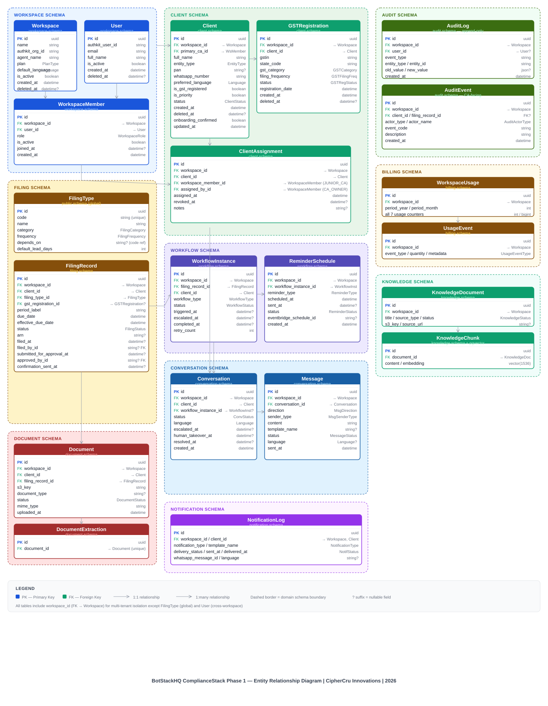

# BotStackHQ — Data Model
### ComplianceStack — Phase 1 MVP
**CipherCru Innovations | 2026**
**Status: ✅ Locked**
**Scope: ComplianceStack MVP — CA / Legal Compliance Workflow Automation**

**Document Chain:** [BotStackHQ Product Overview](Product_Overview.md) → [ADD](BotStackHQ_ComplianceStack_Architecture_Decision_Document.md) → [Actor Definition](BotStackHQ_Actor_Definition_Document_ComplianceStack.md) → [Filing & Compliance Reference](BotStackHQ_Filing_Compliance_Reference.md) → [Agent Flow Specs](BotStackHQ_ComplianceStack_Agent_Flow_Specs.md) → **Data Model** *(this document)*

---

## Purpose

This document defines the complete data model for BotStackHQ ComplianceStack Phase 1. Every entity, field, data type, relationship, constraint, index, and RLS policy is defined here. The Prisma schema and all database migrations are generated directly from this document. No field or table is added to the database without first being defined here.

---

## Key Design Decisions

| Decision | Rule |
|----------|------|
| **ORM** | Prisma with `multiSchema` preview feature — all schema defined in `schema.prisma` |
| **Schema separation** | Domain-based PostgreSQL schemas — 11 schemas, boundaries map to module domains |
| **Multi-tenancy** | Shared DB, domain schemas — `workspace_id` on every tenant table |
| **Row-level security** | PostgreSQL RLS policies enforce workspace isolation at DB layer per schema |
| **Audit trail** | Two-tier — internal (all events) + CA-facing (business events only) |
| **Filing calendar** | Option C — 3-month rolling window, auto-generated at onboarding |
| **GST registration** | Optional per client — zero to many GSTINs |
| **Usage tracking** | All 7 metrics tracked real-time per workspace per month |
| **Soft deletes** | All entities use `deleted_at` — never hard deleted except temp files |
| **Timestamps** | All timestamps UTC, ISO 8601 — `created_at`, `updated_at`, `deleted_at` |
| **IDs** | UUID v4 for all primary keys |

### Domain Schema Map

```
public          → FilingType (global master — no workspace_id)
workspace       → Workspace, User, WorkspaceMember
client          → Client, GSTRegistration, ClientAssignment
filing          → ClientFilingConfig, FilingRecord, FilingDeadlineOverride
workflow        → WorkflowInstance, ReminderSchedule
document        → Document, DocumentExtraction
conversation    → Conversation, Message
notification    → NotificationLog
audit           → AuditLog, AuditEvent
billing         → WorkspaceUsage, UsageEvent
knowledge       → KnowledgeDocument, KnowledgeChunk
```

### Prisma Multi-Schema Configuration

```prisma
generator client {
  provider        = "prisma-client-js"
  previewFeatures = ["multiSchema"]
}

datasource db {
  provider = "postgresql"
  url      = env("DATABASE_URL")
  schemas  = ["public", "workspace", "client", "filing",
               "workflow", "document", "conversation",
               "notification", "audit", "billing", "knowledge"]
}
```

Every model carries a `@@schema("domain")` annotation. Cross-schema foreign keys work natively in PostgreSQL — no restriction. RLS policies applied per schema.

---

## Table of Contents

0. ERD — Entity Relationship Diagram
1. Entity Overview
2. Core Entities
   - 2.1 Workspace `workspace`
   - 2.2 User `workspace`
   - 2.3 WorkspaceMember `workspace`
   - 2.4 Client `client`
   - 2.5 GSTRegistration `client`
   - 2.6 ClientAssignment `client`
3. Filing Entities
   - 3.1 FilingType `public`
   - 3.2 ClientFilingConfig `filing`
   - 3.3 FilingRecord `filing`
   - 3.4 FilingDeadlineOverride `filing`
4. Workflow Entities
   - 4.1 WorkflowInstance `workflow`
   - 4.2 ReminderSchedule `workflow`
5. Document Entities
   - 5.1 Document `document`
   - 5.2 DocumentExtraction `document`
6. Conversation Entities
   - 6.1 Conversation `conversation`
   - 6.2 Message `conversation`
7. Notification Entities
   - 7.1 NotificationLog `notification`
8. Audit Entities
   - 8.1 AuditLog `audit`
   - 8.2 AuditEvent `audit`
9. Usage & Billing Entities
   - 9.1 WorkspaceUsage `billing`
   - 9.2 UsageEvent `billing`
10. Knowledge Base Entities
    - 10.1 KnowledgeDocument `knowledge`
    - 10.2 KnowledgeChunk `knowledge`
11. Entity Relationship Summary
12. Index Reference
13. RLS Policy Reference
14. Enum Reference


---

## 00 ERD — Entity Relationship Diagram



> Full ERD rendered above. All 23 entities grouped by domain schema with relationship cardinality and foreign key connections. Open [`BotStackHQ_Phase1_ERD.svg`](BotStackHQ_Phase1_ERD.svg) directly in any browser for full-resolution view.

The ERD below shows all 23 entities grouped by domain schema, with relationship cardinality and foreign key connections.

### Relationship Cardinality Reference

| Relationship | Cardinality |
|-------------|-------------|
| Workspace → WorkspaceMember | 1 : many |
| Workspace → Client | 1 : many |
| User → WorkspaceMember | 1 : many |
| Client → GSTRegistration | 1 : 0..many |
| Client → ClientAssignment | 1 : 0..many |
| WorkspaceMember → ClientAssignment | 1 : 0..many |
| Client → ClientFilingConfig | 1 : many |
| GSTRegistration → ClientFilingConfig | 1 : 0..many |
| FilingType → ClientFilingConfig | 1 : many |
| ClientFilingConfig → FilingRecord | 1 : many |
| FilingRecord → FilingDeadlineOverride | 1 : 0..many |
| FilingRecord → WorkflowInstance | 1 : 0..many |
| FilingRecord → Document | 1 : 0..many |
| FilingRecord → AuditEvent | 1 : 0..many |
| WorkflowInstance → ReminderSchedule | 1 : many |
| WorkflowInstance → Conversation | 1 : 0..1 |
| Document → DocumentExtraction | 1 : 0..1 |
| Client → Conversation | 1 : 0..many |
| Conversation → Message | 1 : many |
| Workspace → WorkspaceUsage | 1 : many |
| Workspace → AuditLog | 1 : many |
| Workspace → AuditEvent | 1 : many |
| KnowledgeDocument → KnowledgeChunk | 1 : many |

---

## 01 Entity Overview

| Entity | Description | Multi-tenant |
|--------|-------------|-------------|
| `Workspace` | CA firm workspace — top-level tenant | Root |
| `User` | AuthKit user — CA Owner, Junior CA, Support Staff | ✅ |
| `WorkspaceMember` | User ↔ Workspace membership + role | ✅ |
| `Client` | CA's end client — individual or business | ✅ |
| `GSTRegistration` | GSTIN per client per state | ✅ |
| `ClientAssignment` | Junior CA assigned to client | ✅ |
| `FilingType` | Master list of all filing types | Global (no workspace_id) |
| `ClientFilingConfig` | Which filings apply to which client + GSTIN | ✅ |
| `FilingRecord` | One filing instance — one client, one period | ✅ |
| `FilingDeadlineOverride` | CA manual deadline override per filing record | ✅ |
| `WorkflowInstance` | One input collection workflow execution | ✅ |
| `ReminderSchedule` | Scheduled reminders per workflow instance | ✅ |
| `Document` | Uploaded document per filing record | ✅ |
| `DocumentExtraction` | AI-extracted fields from document | ✅ |
| `Conversation` | WhatsApp conversation thread per client | ✅ |
| `Message` | Individual message in a conversation | ✅ |
| `NotificationLog` | Every outbound WhatsApp message sent | ✅ |
| `AuditLog` | Internal — every system event | ✅ |
| `AuditEvent` | CA-facing — business events only | ✅ |
| `WorkspaceUsage` | Monthly usage aggregates per workspace | ✅ |
| `UsageEvent` | Real-time usage increment events | ✅ |
| `KnowledgeDocument` | Source document for RAG knowledge base | ✅ |
| `KnowledgeChunk` | Chunked + embedded text for vector search | ✅ |

---

## 02 Core Entities

---

### 2.1 Workspace

Top-level tenant. Every CA firm has one workspace. All data is scoped to a workspace.

```prisma
model Workspace {
  id                String    @id @default(uuid())
  name              String                          // CA firm name
  slug              String    @unique               // URL-safe identifier
  authkit_org_id    String    @unique               // WorkOS org ID
  whatsapp_phone_id String?                         // Meta WhatsApp phone number ID
  whatsapp_verified Boolean   @default(false)
  agent_name        String    @default("Arya")      // Configurable assistant name
  agent_greeting    String?                         // Custom greeting template
  escalation_threshold EscalationThreshold @default(ONCE) // IMMEDIATE | ONCE | TWICE
  default_language  Language  @default(ENGLISH)
  plan              PlanType  @default(STARTER)
  is_active         Boolean   @default(true)
  created_at        DateTime  @default(now())
  updated_at        DateTime  @updatedAt
  deleted_at        DateTime?

  // Relations
  members           WorkspaceMember[]
  clients           Client[]
  filing_records    FilingRecord[]
  conversations     Conversation[]
  audit_logs        AuditLog[]
  audit_events      AuditEvent[]
  workspace_usage   WorkspaceUsage[]
  knowledge_docs    KnowledgeDocument[]
  @@schema("workspace")
}
```

---

### 2.2 User

AuthKit-managed user. Exists independently of workspace — a user can belong to multiple workspaces (Phase 2 agency use case).

```prisma
model User {
  id              String    @id @default(uuid())
  authkit_user_id String    @unique               // WorkOS user ID
  email           String    @unique
  full_name       String
  phone           String?
  is_active       Boolean   @default(true)
  created_at      DateTime  @default(now())
  updated_at      DateTime  @updatedAt
  deleted_at      DateTime?

  // Relations
  workspace_memberships WorkspaceMember[]
  audit_logs            AuditLog[]
  @@schema("workspace")
}
```

---

### 2.3 WorkspaceMember

Junction table — User ↔ Workspace with role. Defines what a user can do within a specific workspace.

```prisma
model WorkspaceMember {
  id           String          @id @default(uuid())
  workspace_id String
  user_id      String
  role         WorkspaceRole                         // CA_OWNER | JUNIOR_CA | SUPPORT_STAFF
  is_active    Boolean         @default(true)
  invited_at   DateTime        @default(now())
  joined_at    DateTime?
  created_at   DateTime        @default(now())
  updated_at   DateTime        @updatedAt

  // Relations
  workspace    Workspace       @relation(fields: [workspace_id], references: [id])
  user         User            @relation(fields: [user_id], references: [id])
  assignments  ClientAssignment[]

  @@unique([workspace_id, user_id])
  @@index([workspace_id])
  @@index([user_id])
  @@schema("workspace")
}
```

---

### 2.4 Client

A CA's end client. Can be an individual, firm, company, LLP, trust, or HUF. GST registration is optional.

```prisma
model Client {
  id                  String        @id @default(uuid())
  workspace_id        String
  full_name           String                          // Legal name
  display_name        String?                         // Trade name / preferred name
  entity_type         EntityType                      // INDIVIDUAL | HUF | PROPRIETORSHIP |
                                                      // PARTNERSHIP | LLP | PVT_LTD | TRUST
  pan                 String?                         // PAN number
  tan                 String?                         // TAN (if TDS deductor)
  whatsapp_number     String                          // Primary WhatsApp number (with country code)
  email               String?
  preferred_language  Language      @default(ENGLISH)
  is_gst_registered   Boolean       @default(false)
  is_priority         Boolean       @default(false)  // Priority client flag — manual
  primary_ca_id       String                          // WorkspaceMember id of CA Owner (immutable)
  status              ClientStatus  @default(ACTIVE)  // ACTIVE | INACTIVE | ARCHIVED
  onboarding_confirmed Boolean      @default(false)  // WhatsApp confirmation received
  notes               String?                         // Internal CA notes
  created_at          DateTime      @default(now())
  updated_at          DateTime      @updatedAt
  deleted_at          DateTime?

  // Relations
  workspace           Workspace         @relation(fields: [workspace_id], references: [id])
  gst_registrations   GSTRegistration[]
  assignments         ClientAssignment[]
  filing_configs      ClientFilingConfig[]
  filing_records      FilingRecord[]
  conversations       Conversation[]
  documents           Document[]
  audit_events        AuditEvent[]

  @@index([workspace_id])
  @@index([workspace_id, status])
  @@index([whatsapp_number, workspace_id])
  @@index([workspace_id, is_priority])
  @@schema("client")
}
```

---

### 2.5 GSTRegistration

One GSTIN per client per state. A client can have zero to many GSTINs. Each has its own independent filing calendar.

```prisma
model GSTRegistration {
  id                  String              @id @default(uuid())
  workspace_id        String
  client_id           String
  gstin               String                              // 15-digit GSTIN
  legal_name          String                              // As per GST registration
  trade_name          String?
  state_code          String                              // 2-digit state code (e.g. "24" for Gujarat)
  state_name          String                              // Full state name
  gst_category        GSTCategory                         // CATEGORY_I | CATEGORY_II (for QRMP due dates)
  filing_frequency    GSTFilingFrequency                  // MONTHLY | QUARTERLY (QRMP)
  registration_date   DateTime
  status              GSTRegistrationStatus @default(ACTIVE) // ACTIVE | INACTIVE | SURRENDERED
  is_composition      Boolean             @default(false) // Composition scheme — deferred
  created_at          DateTime            @default(now())
  updated_at          DateTime            @updatedAt
  deleted_at          DateTime?

  // Relations
  workspace           Workspace           @relation(fields: [workspace_id], references: [id])
  client              Client              @relation(fields: [client_id], references: [id])
  filing_configs      ClientFilingConfig[]
  filing_records      FilingRecord[]

  @@unique([gstin, workspace_id])
  @@index([workspace_id, client_id])
  @@index([workspace_id, status])
  @@schema("client")
}
```

---

### 2.6 ClientAssignment

Junction table — Junior CA assigned to client. CA Owner can assign multiple Junior CAs per client.

```prisma
model ClientAssignment {
  id                    String          @id @default(uuid())
  workspace_id          String
  client_id             String
  workspace_member_id   String                    // Must be JUNIOR_CA role
  assigned_by_id        String                    // WorkspaceMember id of CA Owner
  assigned_at           DateTime        @default(now())
  revoked_at            DateTime?                 // Null = active assignment
  notes                 String?
  created_at            DateTime        @default(now())
  updated_at            DateTime        @updatedAt

  // Relations
  client                Client          @relation(fields: [client_id], references: [id])
  workspace_member      WorkspaceMember @relation(fields: [workspace_member_id], references: [id])

  @@index([workspace_id, client_id])
  @@index([workspace_id, workspace_member_id])
  @@index([workspace_id, client_id, revoked_at]) // Active assignments query
  @@schema("client")
}
```

---

## 03 Filing Entities

---

### 3.1 FilingType

Global master table — all filing types supported by the platform. No `workspace_id` — shared across all workspaces.

```prisma
model FilingType {
  id                  String          @id @default(uuid())
  code                String          @unique   // GSTR1 | GSTR3B | TDS_24Q | ITR_1 etc.
  name                String                    // Display name
  category            FilingCategory            // GST | DIRECT_TAX
  frequency           FilingFrequency           // MONTHLY | QUARTERLY | YEARLY
  applicable_entities EntityType[]              // Which entity types this filing applies to
  depends_on          String?                   // FilingType code this depends on (e.g. GSTR3B depends on GSTR1)
  default_lead_days   Int                       // Default input collection lead time in days
  due_day             Int?                      // Day of month due (e.g. 11 for GSTR-1 monthly)
  due_month           Int?                      // Month due for yearly filings (e.g. 7 for July)
  description         String?
  is_active           Boolean         @default(true)
  created_at          DateTime        @default(now())
  updated_at          DateTime        @updatedAt

  // Relations
  filing_configs      ClientFilingConfig[]
  filing_records      FilingRecord[]
  @@schema("public")
}
```

---

### 3.2 ClientFilingConfig

Which filings apply to which client (and GSTIN for GST filings). Generated at onboarding. Drives the rolling filing calendar.

```prisma
model ClientFilingConfig {
  id                  String          @id @default(uuid())
  workspace_id        String
  client_id           String
  filing_type_id      String
  gst_registration_id String?                   // Null for direct tax filings
  is_active           Boolean         @default(true)
  lead_days_override  Int?                       // CA override of default lead time
  custom_due_day      Int?                       // CA override of due day
  effective_from      DateTime                   // When this config takes effect
  effective_until     DateTime?                  // Null = indefinite
  created_by_id       String                     // WorkspaceMember id of CA Owner
  created_at          DateTime        @default(now())
  updated_at          DateTime        @updatedAt

  // Relations
  client              Client          @relation(fields: [client_id], references: [id])
  filing_type         FilingType      @relation(fields: [filing_type_id], references: [id])
  gst_registration    GSTRegistration? @relation(fields: [gst_registration_id], references: [id])
  filing_records      FilingRecord[]

  @@unique([client_id, filing_type_id, gst_registration_id])
  @@index([workspace_id, client_id])
  @@index([workspace_id, is_active])
  @@schema("filing")
}
```

---

### 3.3 FilingRecord

One filing instance — one client, one period, one filing type. The core operational entity. Generated by the rolling calendar job.

```prisma
model FilingRecord {
  id                    String          @id @default(uuid())
  workspace_id          String
  client_id             String
  filing_type_id        String
  filing_config_id      String
  gst_registration_id   String?                   // Null for direct tax
  period_label          String                    // Human readable: "June 2026", "Q1 FY2026-27"
  period_start          DateTime                  // Period start date
  period_end            DateTime                  // Period end date
  due_date              DateTime                  // Statutory due date
  effective_due_date    DateTime                  // Actual due date (after override if any)
  input_collection_date DateTime                  // When to start collecting inputs (due - lead_days)
  status                FilingStatus  @default(UPCOMING)
  // UPCOMING | INPUT_TRIGGERED | INPUT_ACKNOWLEDGED | INPUTS_RECEIVED
  // INPUTS_COMPLETE | INPUTS_OVERDUE | PENDING_APPROVAL
  // FILED | CONFIRMED | AT_RISK

  // Filing completion fields (filled by CA on filing)
  arn                   String?                   // Acknowledgement Reference Number
  filed_at              DateTime?
  filed_by_id           String?                   // WorkspaceMember id
  filed_on_portal       String?                   // Which portal (GST portal, Income Tax, TRACES)

  // Approval workflow (for Junior CA submissions)
  submitted_for_approval_at   DateTime?
  submitted_by_id             String?             // Junior CA WorkspaceMember id
  approved_at                 DateTime?
  approved_by_id              String?             // CA Owner WorkspaceMember id
  approval_notes              String?
  rejection_notes             String?

  // Confirmation
  confirmation_sent_at  DateTime?
  confirmation_delivery_status NotificationStatus?

  eventbridge_schedule_id String?                 // AWS EventBridge schedule ARN

  created_at            DateTime        @default(now())
  updated_at            DateTime        @updatedAt

  // Relations
  workspace             Workspace           @relation(fields: [workspace_id], references: [id])
  client                Client              @relation(fields: [client_id], references: [id])
  filing_type           FilingType          @relation(fields: [filing_type_id], references: [id])
  filing_config         ClientFilingConfig  @relation(fields: [filing_config_id], references: [id])
  gst_registration      GSTRegistration?    @relation(fields: [gst_registration_id], references: [id])
  deadline_overrides    FilingDeadlineOverride[]
  workflow_instances    WorkflowInstance[]
  documents             Document[]
  audit_events          AuditEvent[]

  @@unique([client_id, filing_type_id, gst_registration_id, period_start])
  @@index([workspace_id, status])
  @@index([workspace_id, client_id])
  @@index([workspace_id, effective_due_date])
  @@index([workspace_id, input_collection_date])
  @@schema("filing")
}
```

---

### 3.4 FilingDeadlineOverride

CA manual override of a filing due date. Logged for audit.

```prisma
model FilingDeadlineOverride {
  id                String        @id @default(uuid())
  workspace_id      String
  filing_record_id  String
  original_due_date DateTime
  overridden_due_date DateTime
  reason            String                    // e.g. "Government extension announced"
  overridden_by_id  String                    // WorkspaceMember id of CA Owner
  created_at        DateTime      @default(now())

  // Relations
  filing_record     FilingRecord  @relation(fields: [filing_record_id], references: [id])

  @@index([workspace_id, filing_record_id])
  @@schema("filing")
}
```

---

## 04 Workflow Entities

---

### 4.1 WorkflowInstance

One execution of an input collection workflow for a filing record. Tracks state machine transitions.

```prisma
model WorkflowInstance {
  id                String            @id @default(uuid())
  workspace_id      String
  filing_record_id  String
  client_id         String
  workflow_type     WorkflowType                  // INPUT_COLLECTION | REMINDER | CONFIRMATION
  status            WorkflowStatus  @default(PENDING)
  // PENDING | IN_PROGRESS | WAITING_FOR_CLIENT
  // ESCALATED | COMPLETED | FAILED | CANCELLED

  triggered_at      DateTime?
  completed_at      DateTime?
  escalated_at      DateTime?
  escalation_reason String?
  retry_count       Int             @default(0)

  created_at        DateTime        @default(now())
  updated_at        DateTime        @updatedAt

  // Relations
  filing_record     FilingRecord    @relation(fields: [filing_record_id], references: [id])
  reminders         ReminderSchedule[]
  conversations     Conversation[]

  @@index([workspace_id, filing_record_id])
  @@index([workspace_id, status])
  @@index([workspace_id, client_id])
  @@schema("workflow")
}
```

---

### 4.2 ReminderSchedule

Scheduled reminder per workflow instance. Tracks which reminders have been sent.

```prisma
model ReminderSchedule {
  id                    String          @id @default(uuid())
  workspace_id          String
  workflow_instance_id  String
  reminder_type         ReminderType                // T7 | T3 | T1 | POST_DEADLINE
  scheduled_at          DateTime                    // When to send
  sent_at               DateTime?                   // Null = not yet sent
  status                ReminderStatus @default(SCHEDULED)
  // SCHEDULED | SENT | SKIPPED | CANCELLED
  // SKIPPED = inputs received before reminder was needed
  eventbridge_schedule_id String?                   // AWS EventBridge schedule ARN
  created_at            DateTime        @default(now())
  updated_at            DateTime        @updatedAt

  // Relations
  workflow_instance     WorkflowInstance @relation(fields: [workflow_instance_id], references: [id])

  @@index([workspace_id, workflow_instance_id])
  @@index([workspace_id, scheduled_at, status])
  @@schema("workflow")
}
```

---

## 05 Document Entities

---

### 5.1 Document

A document uploaded by a client for a specific filing record.

```prisma
model Document {
  id                String          @id @default(uuid())
  workspace_id      String
  client_id         String
  filing_record_id  String
  original_filename String
  s3_key            String                          // Full S3 object key
  s3_bucket         String
  file_size_bytes   Int
  mime_type         String                          // application/pdf | application/vnd.ms-excel etc.
  document_type     String?                         // SALES_REGISTER | PURCHASE_REGISTER | FORM_16 etc.
  status            DocumentStatus  @default(UPLOADED)
  // UPLOADED | PROCESSING | EXTRACTED | INCOMPLETE | UNREADABLE | VALIDATED
  uploaded_via      UploadChannel   @default(WHATSAPP) // WHATSAPP | DASHBOARD
  uploaded_at       DateTime        @default(now())
  processed_at      DateTime?
  created_at        DateTime        @default(now())
  updated_at        DateTime        @updatedAt

  // Relations
  client            Client          @relation(fields: [client_id], references: [id])
  filing_record     FilingRecord    @relation(fields: [filing_record_id], references: [id])
  extraction        DocumentExtraction?

  @@index([workspace_id, filing_record_id])
  @@index([workspace_id, client_id])
  @@index([workspace_id, status])
  @@schema("document")
}
```

---

### 5.2 DocumentExtraction

AI-extracted structured fields from a document. One-to-one with Document.

```prisma
model DocumentExtraction {
  id                String    @id @default(uuid())
  workspace_id      String
  document_id       String    @unique
  extracted_fields  Json                  // Structured key-value pairs extracted by Document AI
  // e.g. { gstin: "...", period: "...", total_tax: "...", arn: "..." }
  validation_result Json                  // { is_valid: bool, missing_fields: [], issues: [] }
  confidence_score  Float?                // 0.0 - 1.0
  extraction_model  String?               // Which model/version performed extraction
  raw_text          String?               // Full extracted text (for audit / reprocessing)
  created_at        DateTime  @default(now())
  updated_at        DateTime  @updatedAt

  // Relations
  document          Document  @relation(fields: [document_id], references: [id])

  @@index([workspace_id, document_id])
  @@schema("document")
}
```

---

## 06 Conversation Entities

---

### 6.1 Conversation

A WhatsApp conversation thread per client. One active conversation per client at a time. New workflow can reuse existing thread or create a new one.

```prisma
model Conversation {
  id                    String              @id @default(uuid())
  workspace_id          String
  client_id             String
  workflow_instance_id  String?             // Linked workflow (if workflow-driven)
  whatsapp_thread_id    String?             // Meta conversation ID
  status                ConversationStatus  @default(ACTIVE)
  // ACTIVE | ESCALATED | IN_HUMAN_HANDLING | RESOLVED | CLOSED
  language              Language            @default(ENGLISH)
  escalation_reason     String?
  escalated_at          DateTime?
  resolved_at           DateTime?
  resolved_by_id        String?             // WorkspaceMember id
  human_takeover_at     DateTime?
  human_takeover_by_id  String?             // WorkspaceMember id
  created_at            DateTime            @default(now())
  updated_at            DateTime            @updatedAt

  // Relations
  workspace             Workspace           @relation(fields: [workspace_id], references: [id])
  client                Client              @relation(fields: [client_id], references: [id])
  workflow_instance     WorkflowInstance?   @relation(fields: [workflow_instance_id], references: [id])
  messages              Message[]

  @@index([workspace_id, client_id])
  @@index([workspace_id, status])
  @@schema("conversation")
}
```

---

### 6.2 Message

Individual message in a conversation. Stores both inbound (client) and outbound (agent / human) messages.

```prisma
model Message {
  id                String          @id @default(uuid())
  workspace_id      String
  conversation_id   String
  direction         MessageDirection            // INBOUND | OUTBOUND
  sender_type       MessageSenderType           // CLIENT | AGENT | HUMAN
  sender_id         String?                     // WorkspaceMember id if human sender
  content           String                      // Message text
  media_url         String?                     // S3 URL if media message
  media_type        String?                     // Document / image type
  whatsapp_message_id String?                   // Meta message ID
  template_name     String?                     // If sent via template
  language          Language?
  status            MessageStatus   @default(SENT)
  // SENT | DELIVERED | READ | FAILED
  delivered_at      DateTime?
  read_at           DateTime?
  failed_reason     String?
  sent_at           DateTime        @default(now())
  created_at        DateTime        @default(now())

  // Relations
  conversation      Conversation    @relation(fields: [conversation_id], references: [id])

  @@index([workspace_id, conversation_id])
  @@index([workspace_id, conversation_id, sent_at])
  @@schema("conversation")
}
```

---

## 07 Notification Entities

---

### 7.1 NotificationLog

Every outbound WhatsApp message sent by the system — templates and conversational. Tracks delivery status independently from message table.

```prisma
model NotificationLog {
  id                String              @id @default(uuid())
  workspace_id      String
  client_id         String
  message_id        String?                         // Linked Message id
  notification_type NotificationType                // ONBOARDING | INPUT_COLLECTION |
                                                    // REMINDER | CONFIRMATION | ESCALATION | QUERY_RESPONSE
  template_name     String?
  language          Language
  whatsapp_message_id String?                       // Meta message ID for tracking
  delivery_status   NotificationStatus  @default(PENDING)
  // PENDING | SENT | DELIVERED | READ | FAILED
  sent_at           DateTime?
  delivered_at      DateTime?
  read_at           DateTime?
  failed_reason     String?
  created_at        DateTime            @default(now())
  updated_at        DateTime            @updatedAt

  @@index([workspace_id, client_id])
  @@index([workspace_id, notification_type])
  @@index([workspace_id, delivery_status])
  @@schema("notification")
}
```

---

## 08 Audit Entities

---

### 8.1 AuditLog (Internal)

Every system event — append-only, never updated or deleted. Retention: 7 years.

```prisma
model AuditLog {
  id            String    @id @default(uuid())
  workspace_id  String
  user_id       String?                   // Null for system-generated events
  event_type    String                    // e.g. filing.status.changed, document.uploaded
  entity_type   String                    // e.g. FilingRecord, Document, Client
  entity_id     String                    // ID of affected entity
  old_value     Json?                     // Previous state
  new_value     Json?                     // New state
  metadata      Json?                     // Additional context
  ip_address    String?
  user_agent    String?
  created_at    DateTime  @default(now())

  // Relations
  workspace     Workspace @relation(fields: [workspace_id], references: [id])
  user          User?     @relation(fields: [user_id], references: [id])

  @@index([workspace_id, entity_type, entity_id])
  @@index([workspace_id, created_at])
  @@index([workspace_id, user_id])
  @@schema("audit")
}
```

---

### 8.2 AuditEvent (CA-facing)

Business events only — clean, readable, exportable. What the CA sees on the dashboard audit trail.

```prisma
model AuditEvent {
  id              String    @id @default(uuid())
  workspace_id    String
  client_id       String?
  filing_record_id String?
  actor_type      AuditActorType            // SYSTEM | CA_OWNER | JUNIOR_CA | SUPPORT_STAFF | CLIENT
  actor_id        String?                   // WorkspaceMember id or client id
  actor_name      String                    // Display name for audit trail
  event_code      String                    // INPUT_COLLECTION_TRIGGERED | DOCUMENT_RECEIVED |
                                            // FILING_COMPLETE | CONFIRMATION_SENT | etc.
  description     String                    // Human-readable description
  metadata        Json?                     // Relevant details (ARN, period, etc.)
  created_at      DateTime  @default(now())

  // Relations
  workspace       Workspace     @relation(fields: [workspace_id], references: [id])
  client          Client?       @relation(fields: [client_id], references: [id])
  filing_record   FilingRecord? @relation(fields: [filing_record_id], references: [id])

  @@index([workspace_id, client_id])
  @@index([workspace_id, filing_record_id])
  @@index([workspace_id, created_at])
  @@schema("audit")
}
```

---

## 09 Usage & Billing Entities

---

### 9.1 WorkspaceUsage

Monthly aggregated usage per workspace. Used for billing calculation and dashboard metrics.

```prisma
model WorkspaceUsage {
  id                          String    @id @default(uuid())
  workspace_id                String
  period_year                 Int                       // e.g. 2026
  period_month                Int                       // 1-12
  active_clients_count        Int       @default(0)
  active_gstins_count         Int       @default(0)
  agent_conversations_count   Int       @default(0)
  whatsapp_messages_sent_count Int      @default(0)
  documents_processed_count   Int       @default(0)
  workflow_executions_count   Int       @default(0)
  llm_tokens_used_count       BigInt    @default(0)
  billing_calculated          Boolean   @default(false)
  billing_amount              Decimal?  @db.Decimal(10, 2)
  created_at                  DateTime  @default(now())
  updated_at                  DateTime  @updatedAt

  // Relations
  workspace                   Workspace @relation(fields: [workspace_id], references: [id])

  @@unique([workspace_id, period_year, period_month])
  @@index([workspace_id])
  @@schema("billing")
}
```

---

### 9.2 UsageEvent

Real-time usage increment events. Aggregated into WorkspaceUsage monthly.

```prisma
model UsageEvent {
  id            String        @id @default(uuid())
  workspace_id  String
  event_type    UsageEventType  // CONVERSATION_STARTED | MESSAGE_SENT | DOCUMENT_PROCESSED |
                                // WORKFLOW_EXECUTED | LLM_TOKENS_USED
  quantity      Int           @default(1)
  metadata      Json?                       // e.g. { token_count: 1250, model: "gpt-4o" }
  created_at    DateTime      @default(now())

  @@index([workspace_id, event_type])
  @@index([workspace_id, created_at])
  @@schema("billing")
}
```

---

## 10 Knowledge Base Entities

---

### 10.1 KnowledgeDocument

Source document uploaded to the knowledge base for RAG. Per workspace — CA can upload firm-specific FAQs, guides, and templates.

```prisma
model KnowledgeDocument {
  id            String    @id @default(uuid())
  workspace_id  String
  title         String
  source_type   KnowledgeSourceType   // PDF | FAQ | WEBSITE | MANUAL
  s3_key        String?               // For uploaded files
  source_url    String?               // For web sources
  status        KnowledgeStatus @default(PROCESSING)
  // PROCESSING | READY | FAILED
  chunk_count   Int       @default(0)
  created_by_id String?               // WorkspaceMember id
  created_at    DateTime  @default(now())
  updated_at    DateTime  @updatedAt

  // Relations
  workspace     Workspace       @relation(fields: [workspace_id], references: [id])
  chunks        KnowledgeChunk[]

  @@index([workspace_id, status])
  @@schema("knowledge")
}
```

---

### 10.2 KnowledgeChunk

Chunked and embedded text for vector similarity search. Uses pgvector.

```prisma
model KnowledgeChunk {
  id              String    @id @default(uuid())
  workspace_id    String
  document_id     String
  chunk_index     Int                           // Position in document
  content         String                        // Raw text of chunk
  embedding       Unsupported("vector(1536)")?  // OpenAI text-embedding-3-small
  token_count     Int
  metadata        Json?                         // Page number, section, etc.
  created_at      DateTime  @default(now())

  // Relations
  document        KnowledgeDocument @relation(fields: [document_id], references: [id])

  @@index([workspace_id, document_id])
  @@schema("knowledge")
}
```

---

## 11 Entity Relationship Summary

```
Workspace
  ├── WorkspaceMember (users + roles)
  │     └── User (AuthKit)
  ├── Client
  │     ├── GSTRegistration (0 to many)
  │     ├── ClientAssignment (0 to many Junior CAs)
  │     ├── ClientFilingConfig (1 per filing type per GSTIN)
  │     │     └── FilingRecord (1 per period)
  │     │           ├── FilingDeadlineOverride (0 to many)
  │     │           ├── WorkflowInstance (1 per workflow type)
  │     │           │     └── ReminderSchedule (T-7, T-3, T-1)
  │     │           └── Document (0 to many)
  │     │                 └── DocumentExtraction (1 per document)
  │     └── Conversation (1 active at a time)
  │           └── Message (many)
  ├── NotificationLog (all outbound messages)
  ├── AuditLog (internal — all events)
  ├── AuditEvent (CA-facing — business events)
  ├── WorkspaceUsage (monthly aggregates)
  ├── UsageEvent (real-time increments)
  └── KnowledgeDocument
        └── KnowledgeChunk (embedded vectors)
```

---

## 12 Index Reference

Critical indexes for query performance at scale.

| Table | Index Fields | Purpose |
|-------|-------------|---------|
| `Client` | `workspace_id, status` | Dashboard client list |
| `Client` | `whatsapp_number, workspace_id` | Inbound message routing |
| `Client` | `workspace_id, is_priority` | Priority client notifications |
| `FilingRecord` | `workspace_id, status` | Filing status dashboard |
| `FilingRecord` | `workspace_id, effective_due_date` | Upcoming deadline queries |
| `FilingRecord` | `workspace_id, input_collection_date` | EventBridge trigger queries |
| `FilingRecord` | `client_id, filing_type_id, period_start` | Unique constraint + lookup |
| `WorkflowInstance` | `workspace_id, status` | Active workflow monitoring |
| `Message` | `workspace_id, conversation_id, sent_at` | Conversation history |
| `AuditLog` | `workspace_id, entity_type, entity_id` | Entity audit trail lookup |
| `AuditEvent` | `workspace_id, client_id` | Client audit trail |
| `WorkspaceUsage` | `workspace_id` | Billing queries |
| `UsageEvent` | `workspace_id, created_at` | Usage aggregation job |
| `KnowledgeChunk` | `workspace_id, document_id` | RAG retrieval |

**pgvector index on KnowledgeChunk.embedding:**
```sql
CREATE INDEX knowledge_chunk_embedding_idx 
ON "KnowledgeChunk" 
USING ivfflat (embedding vector_cosine_ops)
WITH (lists = 100);
```

---

## 13 RLS Policy Reference

PostgreSQL Row-Level Security enforces workspace isolation at DB layer — safety net on top of application-level filtering.

```sql
-- Enable RLS on all tenant tables
ALTER TABLE "Client" ENABLE ROW LEVEL SECURITY;
ALTER TABLE "GSTRegistration" ENABLE ROW LEVEL SECURITY;
ALTER TABLE "FilingRecord" ENABLE ROW LEVEL SECURITY;
ALTER TABLE "Document" ENABLE ROW LEVEL SECURITY;
ALTER TABLE "Conversation" ENABLE ROW LEVEL SECURITY;
ALTER TABLE "Message" ENABLE ROW LEVEL SECURITY;
-- (repeat for all workspace-scoped tables)

-- Policy: application role can only access rows 
-- matching current_setting workspace_id
CREATE POLICY workspace_isolation ON "Client"
  USING (workspace_id = current_setting('app.workspace_id')::uuid);

-- NestJS sets this at the start of every request:
-- SET LOCAL app.workspace_id = '[workspace_id from JWT]';
```

---

## 14 Enum Reference

```prisma
enum WorkspaceRole {
  CA_OWNER
  JUNIOR_CA
  SUPPORT_STAFF
}

enum EntityType {
  INDIVIDUAL
  HUF
  PROPRIETORSHIP
  PARTNERSHIP
  LLP
  PVT_LTD
  TRUST
}

enum ClientStatus {
  ACTIVE
  INACTIVE
  ARCHIVED
}

enum Language {
  ENGLISH
  HINDI
  GUJARATI
  MARATHI
  TAMIL
  TELUGU
  KANNADA
  BENGALI
  PUNJABI
}

enum GSTCategory {
  CATEGORY_I
  CATEGORY_II
}

enum GSTFilingFrequency {
  MONTHLY
  QUARTERLY
}

enum GSTRegistrationStatus {
  ACTIVE
  INACTIVE
  SURRENDERED
}

enum FilingCategory {
  GST
  DIRECT_TAX
}

enum FilingFrequency {
  MONTHLY
  QUARTERLY
  YEARLY
}

enum FilingStatus {
  UPCOMING
  INPUT_TRIGGERED
  INPUT_ACKNOWLEDGED
  INPUTS_RECEIVED
  INPUTS_COMPLETE
  INPUTS_OVERDUE
  PENDING_APPROVAL
  FILED
  CONFIRMED
  AT_RISK
}

enum WorkflowType {
  INPUT_COLLECTION
  REMINDER
  CONFIRMATION
}

enum WorkflowStatus {
  PENDING
  IN_PROGRESS
  WAITING_FOR_CLIENT
  ESCALATED
  COMPLETED
  FAILED
  CANCELLED
}

enum ReminderType {
  T7
  T3
  T1
  POST_DEADLINE
}

enum ReminderStatus {
  SCHEDULED
  SENT
  SKIPPED
  CANCELLED
}

enum DocumentStatus {
  UPLOADED
  PROCESSING
  EXTRACTED
  INCOMPLETE
  UNREADABLE
  VALIDATED
}

enum UploadChannel {
  WHATSAPP
  DASHBOARD
}

enum ConversationStatus {
  ACTIVE
  ESCALATED
  IN_HUMAN_HANDLING
  RESOLVED
  CLOSED
}

enum MessageDirection {
  INBOUND
  OUTBOUND
}

enum MessageSenderType {
  CLIENT
  AGENT
  HUMAN
}

enum MessageStatus {
  SENT
  DELIVERED
  READ
  FAILED
}

enum NotificationType {
  ONBOARDING
  INPUT_COLLECTION
  REMINDER
  CONFIRMATION
  ESCALATION
  QUERY_RESPONSE
}

enum NotificationStatus {
  PENDING
  SENT
  DELIVERED
  READ
  FAILED
}

enum AuditActorType {
  SYSTEM
  CA_OWNER
  JUNIOR_CA
  SUPPORT_STAFF
  CLIENT
}

enum UsageEventType {
  CONVERSATION_STARTED
  MESSAGE_SENT
  DOCUMENT_PROCESSED
  WORKFLOW_EXECUTED
  LLM_TOKENS_USED
}

enum EscalationThreshold {
  IMMEDIATE
  ONCE
  TWICE
}

enum PlanType {
  STARTER
  GROWTH
  BUSINESS
  ENTERPRISE
}

enum KnowledgeSourceType {
  PDF
  FAQ
  WEBSITE
  MANUAL
}

enum KnowledgeStatus {
  PROCESSING
  READY
  FAILED
}
```

---

*This document is the authoritative data model for BotStackHQ ComplianceStack Phase 1. No database entity, field, or index is added without first being defined here. The Prisma schema is generated directly from this document.*
*CipherCru Innovations | BotStackHQ | 2026 | Confidential*
